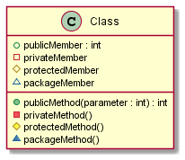
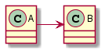
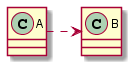
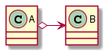
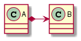
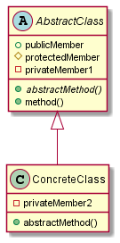
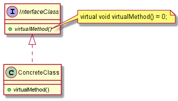
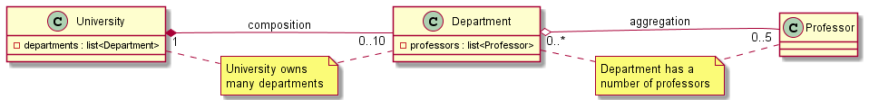
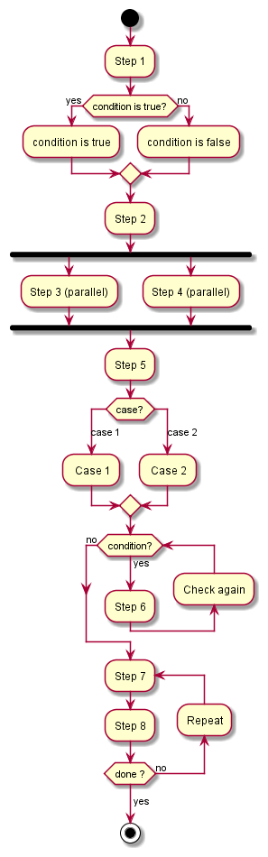
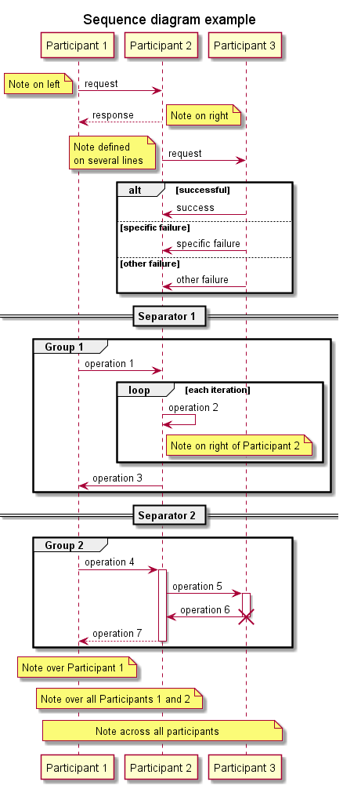

# Unified Modeling Language basics

## Table of contents

- [Introduction](#introduction)
- [Structure diagrams](#structure-diagrams)
    - [Class diagram](#class-diagram)
- [Behavior diagrams](#behavior-diagrams)
    - [Activity diagram](#activity-diagram)
    - [Sequence diagram](#sequence-diagram)
- [Tools](#tools)
- [References](#references)

## Introduction

The [Unified Modeling Language][ref-uml] (UML) is a general-purpose, developmental modeling language in the field of software engineering that is intended to provide a standard way to visualize the design of a system. UML offers the following to visualize a system architecture:

- Activities (jobs).
- Individual components of the system, and how they can interact with other software components.
- How the system will run.
- How entities interact with others (components and interfaces).
- External user interface.

UML diagrams are divided into 2 categories:

- Structure diagrams.
- Behavior diagrams.

## Structure diagrams

The structure diagrams:

- Represent the static aspects of the system.
- Emphasize the things that must be present in the system being modeled.
- Are used extensively in documenting the software architecture of software systems.

This type of diagrams includes:

- Class diagram.
- Component diagram.
- Composite structure diagram.
- Deployment diagram.
- Object diagram.
- Package diagram.
- Profile diagram.

In this documentation, only the class diagram is detailed.

### Class diagram

[Class diagrams][ref-uml-class-diagram] describe the structure of a system by showing the system's classes, their attributes, operations (or methods/functions), and the relationships among objects.

#### Members

To specify the visibility of a class member (i.e. any attribute or method), these notations must be placed before the members' name:

| Character | Visibility |
| :---: | :---: |
| `+` | Public |
| `-` | Private |
| `#` | Protected |
| `~` | Package |

Notation example generated using PlantUML (see [Tools](#tools)):



#### Class relationships

A relationship is a general term covering the specific types of logical connections found on class and object diagrams. UML defines the following relationships:

**Association**

An *Association* (*knows*) represents a relationship where one element knows the other.



**Dependency**

A *Dependency* (*uses*) represents a relationship that exists between two elements if changes to the definition of one element may cause changes to the other.



**Aggregation**

An *Aggregation* (*has*) represents a part-whole or part-of relationship. It can occur when a class is a collection or container of other classes, but the contained classes do not have a strong lifecycle dependency on the container. The contents of the container still exist when the container is destroyed, so it doesn't have ownership of the contained class (e.g., *shared/weak pointer* to the contained class, `std::vector<std::shared_ptr<Class>>`).



**Composition**

A *Composition* (*has*) represents a stronger form of the aggregation relationship, where the aggregate controls the lifecycle of the elements it aggregates. When the container is destroyed, the contents are also destroyed (e.g., *unique pointer* to the contained class, `std::vector<std::unique_ptr<Class>>`).



**Inheritance**

An *Inheritance* (*extends*) represents a relationship where one of the two related classes (known as subclass, child or derived class) is considered to be a specialized form of the other (known as superclass, parent or base class), being the superclass considered a generalization of the subclass.



**Realization**

A *Realization* (*implements*) represents a relationship between two elements, in which one of them (the client) implements/realizes the behavior that the other class (the supplier/interface) specifies.



**Multiplicity**

UML allows the specification of the multiplicity in a relation (the range of number of objects that participate), as follows:

| Multiplicity | Description |
| :---: | :---: |
| 0 | No instances |
| 0..1 | No instances, or one instance |
| 1 | Exactly one instance |
| 1..1 | Exactly one instance |
| 0..* | Zero or more instances |
| 1..* | One or more instances |

The example below demonstrates a multiplicity relation: a university owns many departments, and each department has a number of professors. If the university closes, the departments will no longer exist (composition), but the professors in those departments will continue to exist (aggregation). It is worth to also mention that a professor can work in more than one department, but a department cannot be part of more than one university.



## Behavior diagrams

The behavior diagrams:

- Represent the dynamic aspect of the system.
- Emphasize what must happen in the system being modeled.
- Are used extensively to describe the functionality of software systems.

This type of diagrams includes:

- Activity diagram.
- Communication diagram.
- Interaction overview diagram.
- Sequence diagram.
- State diagram.
- Timing diagram.
- Use case diagram.

In this documentation, only the activity and the sequence diagrams are detailed.

### Activity diagram

[Activity diagrams][ref-uml-activity-diagram] are graphical representations of workflows of stepwise activities and actions with support for choice, iteration and concurrency. These diagrams can be regarded as a form of a structured flowchart combined with a traditional data flow diagram.

An activity diagram example:



### Sequence diagram

[Sequence diagrams][ref-uml-sequence-diagram] show process interactions arranged in time sequence that detail how operations are carried out.

A sequence diagram example:



## Tools

There are many [tools][ref-uml-tools] that support some functions of UML. PlantUML is one of them, it is an open-source tool allowing users to create diagrams from a plain text language.

This tool can be used from the command line to generate an image from a file, as follows:

```sh
$ java -jar <plantuml.jar> -verbose <plantuml_file>
$ # Or
$ plantuml -verbose <plantuml_file>
```

The diagrams presented in this document were built using PlantUML (the code is available in the [`assets`](./assets/) directory).

## References

- [UML][ref-uml]
- [Class diagram][ref-uml-class-diagram]
- [Activity diagram][ref-uml-activity-diagram]
- [Sequence diagram][ref-uml-sequence-diagram]
- [UML tools][ref-uml-tools]

[ref-uml]: https://en.wikipedia.org/wiki/Unified_Modeling_Language "UML"
[ref-uml-class-diagram]: https://en.wikipedia.org/wiki/Class_diagram "Class diagram"
[ref-uml-activity-diagram]: https://en.wikipedia.org/wiki/Activity_diagram "Activity diagram"
[ref-uml-sequence-diagram]: https://en.wikipedia.org/wiki/Sequence_diagram "Sequence diagram"
[ref-uml-tools]: https://en.wikipedia.org/wiki/List_of_Unified_Modeling_Language_tools "UML tools"
